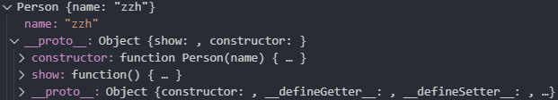
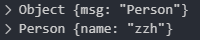

## 模拟new实现
我对new的理解：
>对一个函数(fn)一顿操作之后，返回一个对象(obj)

---

#### 第一版
实现思路：用apply把对象this挂到函数里
```javascript
function myNew(fn, ...args) {
    const obj = {};
    //  连接原型链
    Object.setPrototypeOf(obj, fn.prototype);
    fn.apply(obj, args);
    return obj;
};
```

输入以下代码进行测试：
```javascript
function Person(name) {
    this.name = name;
};

console.log(
    myNew(Person, "zzh");
);
```

可以看到控制台中返回了一个对象。
- 带有一个属性name字段的
- __proto__上有show方法。
- __proto__的contructor指向了person构造函数。

结果


第一版完成。

---
Next

在被new操作的函数里返回对象是会覆盖掉原来的对象 示例：
```javascript
function Person(name) {
    this.name = name;
    return { msg: "Person" };  // +
};

// 原版与my版比较
console.log(
    new Person("zzh"),
    myNew(Person, "zzh"),      // +
);
```
结果



改一下

思路：</br>
获取构造函数的返回值。</br>
判断构造函数的返回值是不是对象。


#### 第二版

```javascript
function myNew(fn, ...args) {
    const obj = {};
    //  连接原型链
    Object.setPrototypeOf(obj, fn.prototype)
    const res = fn.apply(obj, args);

    //  判断fn的返回值是不是对象 
    return typeof res === "object" ? res : obj;
};
```

再次运行
```javascript
console.log(
    new Person("zzh"),
    myNew(Person, "zzh"),
);
```

结果


到这就算结束了


