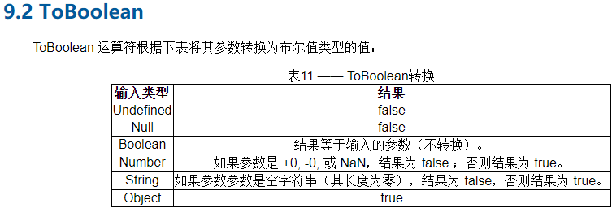
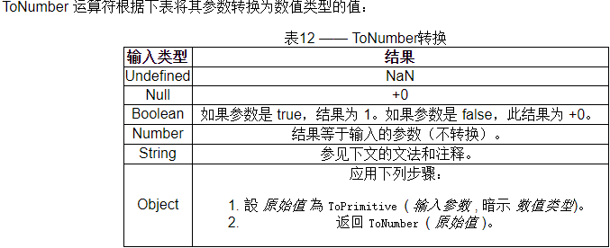
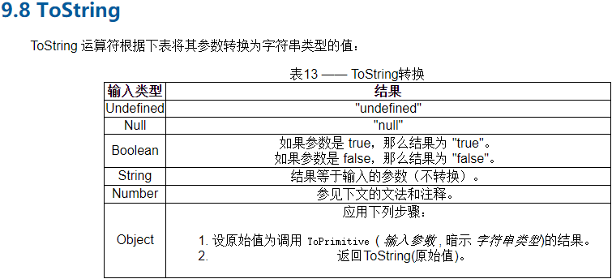

### 隐式(自动)类型转换:
\+, if(), == 

### 显示(强制)类型转换
String(), Number(), Boolean(), parseInt(), parseFloat()

---

### 首先要理解几个规范
#### ToPrimitive(value, preferedType?) [ES5规范#103](http://yanhaijing.com/es5/#103)
ToPrimitive接受一个值value和一个可选的期望类型preferedType

如果期望值为number，会执行以下步骤：

1. 如果value是基本类型, 返回value;
2. 如果value是对象，首先调用原型链的valueOf()方法。如果返回值是基本类型，返回结果;
3. 调用value.toString()。如果返回值是基本类型，返回结果；

如果期望值的类型是String，2和3会交换执行，即先执行toString()方法，后执行toValue()方法。
#### ToBoolean [ES5规范#104](http://yanhaijing.com/es5/#104)

#### ToNumber [ES5规范#105](http://yanhaijing.com/es5/#105)

#### ToString [ES5规范#111](http://yanhaijing.com/es5/#111)
