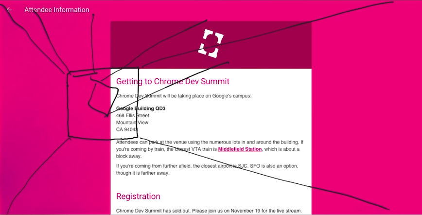

## 第二课

#### App的生命周期  
Load -> Idle -> Animate -> Response
1. 加载（1secound）需要加在必要的功能组件
2. 闲置（50ms）页面加载完成等待用户进行操作，这时可以加载视频，图片等等资源
3. 动画（16ms）浏览器每16ms会渲染一次，即60FPS，这个时间内动画是非常丝滑的
4. 对用户的交互做出回应（100ms） 指的是用户按下按钮之后的十分之一秒，如果还没有回应，用户就会觉得不耐烦

#### 动画（Animae）

视频中作者的策略是`FLIP` 
> 很少的成本去运行它

First Last Invert Play

1. First 使用getBoundingClientRect()方法计算元素起始位置
2. Last 使用同样的方法计算元素的结束位置
3. Invert 反转动画什么玩意听不到
4. Play 开始播放动画

